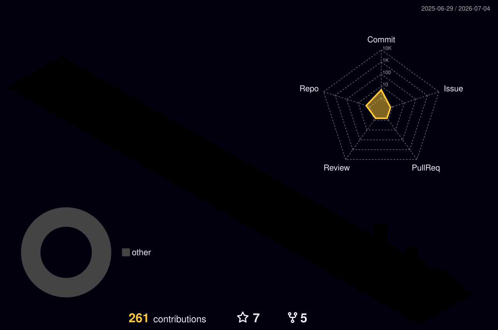

  <em>Java/Kotlin·Python · Spring/FastAPI 기반 7년차 백엔드 개발자</em> 
  RAG·VectorDB 검색 시스템을 설계·운영하고, 온디바이스 sLLM(QLoRA 파인튜닝)까지 다룹니다.

  
  

---

### 🔭 지금 하는 일
- 온디바이스/sLLM 환경에 최적화된 **RAG 문서 검색 시스템** 설계·엔지니어링
- 임베딩·LLM·리랭커를 자유롭게 교체하는 **플러그인형 검색 파이프라인**, 골든셋 기반 **정량 평가 체계** 구축

### 🌱 관심사
- RAG · Ontology · 데이터 정제 · 사용자 질의 의도 파악
- 대용량 트래픽 · 비동기 메시징 · 클라우드 인프라(IaC) · 레거시 마이그레이션

---

### 🛠 Tech Stack

**Languages & Frameworks**

  
  
  
  
  

**AI & Search**

  
  
  
  

**Infra & DevOps**

  
  
  
  
  

**Database & Messaging**

  
  
  
  

---

### 🤝 Open Source & Community
- **Spring Cloud AWS** — SQS 이슈 대응 및 PR 기여 ([PR #1388](https://github.com/awspring/spring-cloud-aws/pull/1388))
- **Jtokkit** — OpenAI 토크나이저 라이브러리 개선 제안 ([#80](https://github.com/knuddelsgmbh/jtokkit/issues/80))
- 오픈소스 기여 모임 운영진 · 글또(개발자 글쓰기) · 주니어 멘토링

---

  

